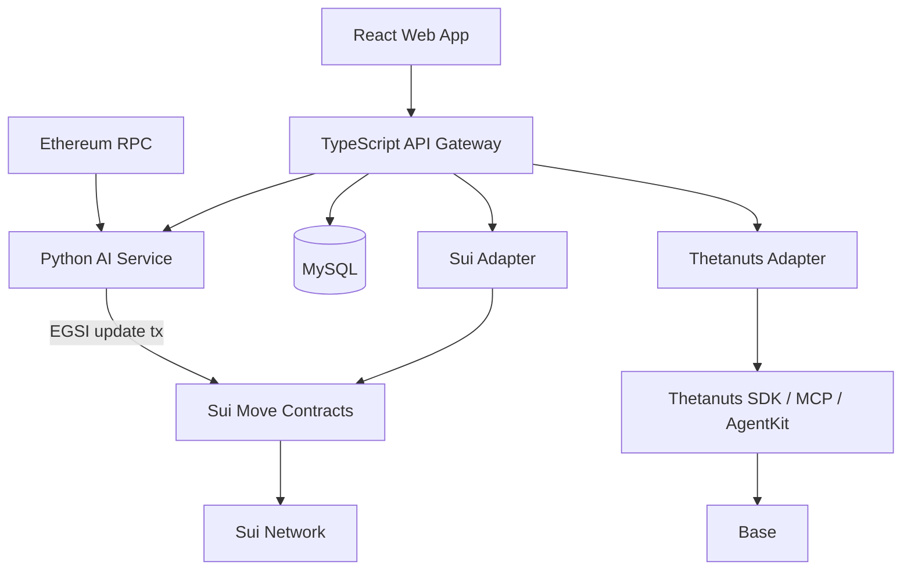
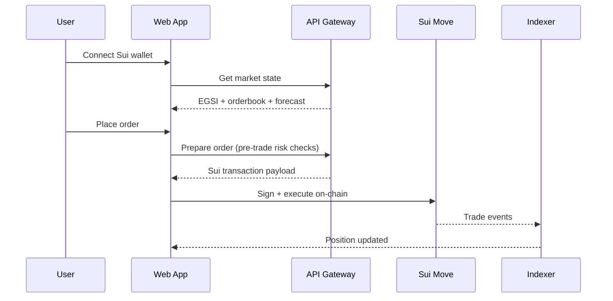
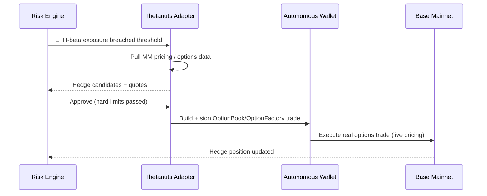

# GASX — Architecture (Hackathon)

Constraints: **must use Sui + Thetanuts; frontend is a web app. Judged bar (MUBA HACKS 2026, Thetanuts Track 02): at least one real on-chain options trade on Thetanuts' OptionBook or OptionFactory, live on Base mainnet, executed by the AI agent.**

> Reading order: [README.md](README.md) (idea) → [GLOSSARY.md](GLOSSARY.md) (terms) → [GOALS.md](GOALS.md) (what to build, in what order) → this file (how to build it). New developers start with GOALS' Phase 0, then use §2 and §11 to find their way around the codebase.

---

## 1. System Overview



---

## 2. Component Map

| Component | Tech | Responsibility |
|---|---|---|
| Web frontend | React + TypeScript + Sui dApp Kit | Wallet, market screen, order form, positions, hedge view |
| API gateway | TypeScript (Fastify/Express + WS) | REST + WebSocket, transaction preparation, indexing |
| AI service | Python (FastAPI) | Ingest Ethereum data, compute EGSI, forecast, publish oracle |
| Sui contracts | Move | Order book, margin, positions, oracle state, settlement |
| Thetanuts adapter | TypeScript | Market data, MM pricing, RFQ, autonomous hedge execution |
| Storage | MySQL | Durable state; live EGSI/orderbook cached in API memory |

Backend service boundaries are invisible to the frontend: the UI only talks to stable domain APIs (`/api/v1/...`, `/ws/...`).

---

## 3. EGSI — Ethereum Gas Stress Index

Normalized **0–1000** score of current/near-future blockspace stress.

v1 inputs (hand-tuned weighted sum):

```text
base fee          (normalized, weighted)
block utilization
mempool pressure  (pending tx estimate)
fee momentum      (short-term fee acceleration)
gas volatility
DEX/DeFi activity
Thetanuts ETH option implied volatility   (wired in during Phase 4 — see GOALS.md)
```

Thetanuts IV helps distinguish "gas is rising because Ethereum is busy" from "gas is rising inside a broad crypto volatility shock" — these deserve different hedge behavior.

---

## 4. AI Forecast

One small model, not an ensemble:

- Features: EGSI history (EMA/RSI/momentum), network metrics, Thetanuts IV/skew signals.
- Model: LightGBM regressor; a simple quantile band yields `P(EGSI > threshold)`.
- Must beat naive baselines (`last_value`, `moving_average`) out-of-sample; otherwise ship the baseline.
- Hard-coded fallback forecast keeps the demo alive if the model fails.

Output schema consumed by the API and risk engine:

```json
{
  "market": "EGSI-1H",
  "expected_egsi": 441.2,
  "confidence": 0.91,
  "p_tail_500": 0.21,
  "model_version": "egsi-v1"
}
```

---

## 5. Sui Move Contracts

```text
contracts/gasx/sources/
├── market.move        Market (single EGSI-1H market)
├── order.move         Limit orders, price-time priority
├── margin.move        USDC collateral lock/unlock
├── position.move      Trader positions
├── oracle.move        EGSI oracle state
├── settlement.move    Expiry P&L (linear payoff, USDC)
└── events.move        Emitted events for the indexer
```

- **Single market**: EGSI-1H, 1-hour expiry, fixed contract multiplier and tick size.
- **Order book**: simple on-chain limit book (fixed-point arithmetic). No DeepBook dependency in the MVP.
- **Margin**: USDC locked on order placement, released on cancel/close.
- **Settlement**: linear payoff `(final_EGSI - entry_price) × multiplier × qty`, paid in USDC. ETH-denominated settlement is explicitly deferred.

---

## 6. Oracle

One publisher (the AI service) submits EGSI updates to `OracleState` on Sui. Settlement rejects stale, out-of-range or wrong-market updates. Multi-publisher 2-of-3 attestation is deferred.

---

## 7. Thetanuts Integration

Three touchpoints, one adapter (`HedgeProvider`-style interface so Thetanuts types never leak):

1. **Data** — ETH options IV/skew/MM pricing feed the AI features and sanity-check GASX's own ETH-risk estimate.
2. **RFQ hedge** — when GASX's ETH-beta exposure exceeds a threshold, request quotes and present the best candidate to the risk engine.
3. **Autonomous execution** — the AI agent places real options trades on Thetanuts' **OptionBook / OptionFactory on Base mainnet** through the SDK/AgentKit path, with a dedicated, isolated wallet. Live pricing only; testnet execution does not meet the bar. The SDK is the runtime dependency; the MCP is a dev-time inspection tool only.

---

## 8. Hard Risk Policy

> **AI can request an action. It cannot bypass policy.**

```text
MAX_ORDER_CONTRACTS    small fixed cap
MAX_POSITION_CONTRACTS small fixed cap
MAX_SLIPPAGE           1%
MIN_MODEL_CONFIDENCE   70%
MAX_HEDGE_NOTIONAL     small configured budget
Hedge wallet           isolated from user funds; Base + [ETH, USDC] only
```

Enforced outside the language model, in the API/contracts.

---

## 9. Trade Flow



---

## 10. Hedge Flow



---

## 11. Repository Layout

```text
gasx/
├── README.md / GOALS.md / ARCHITECTURE.md / GLOSSARY.md / setup.md
├── frontend/         React web app
├── api/              TypeScript gateway + Sui/Thetanuts adapters
├── ai/               Python ingestion, EGSI, model, inference
├── contracts/gasx/   Move packages
├── database/         MySQL migrations
├── scripts/          setup.ps1 / setup.sh / teardown.ps1 / teardown.sh
├── .vscode/          recommended extensions
```

---

## 12. Decisions

| Decision | Choice |
|---|---|
| Trading/settlement chain | Sui (Move) — testnet acceptable for GASX; **only the Thetanuts options trade must be mainnet** |
| Product | EGSI-1H futures, single market |
| Collateral / settlement | USDC / USDC (linear payoff) |
| Order book | Simple on-chain limit book |
| AI | Single LightGBM forecast + fallback |
| Thetanuts | Data + MM pricing + RFQ + AI-agent options execution on Base mainnet (OptionBook/OptionFactory); SDK runtime, MCP dev-only |
| Judged deliverable | AI agent places ≥1 real options trade on Thetanuts, Base mainnet, live pricing |
| Oracle | Single publisher (AI service) |
| Cache | In-memory in the API (Redis deferred post-hackathon) |
| Deployment | Native services in WSL; frontend served as static site |

## 13. Explicitly Deferred (post-hackathon)

C++ engine, NATS event bus, DeepBook CLOB, multi-publisher oracle, multiple maturities, ETH-denominated settlement, Prometheus/Grafana, Kubernetes, production custody, Wormhole.
