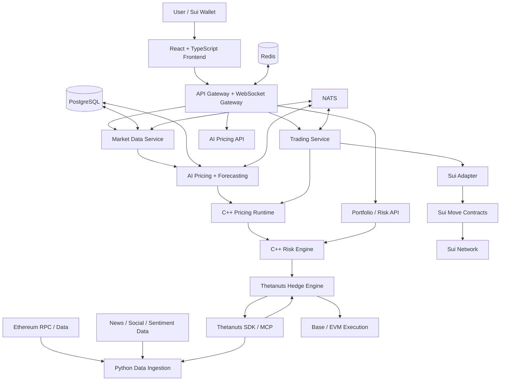
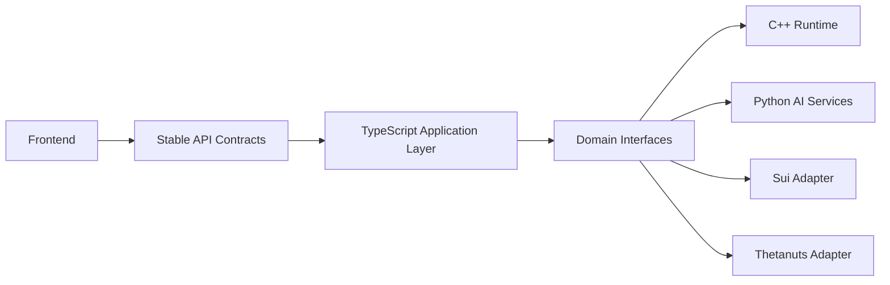
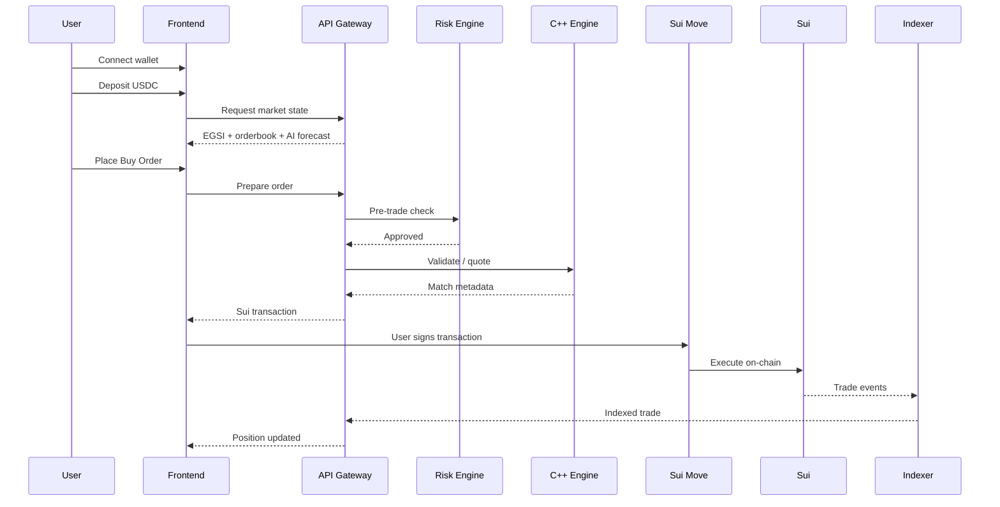
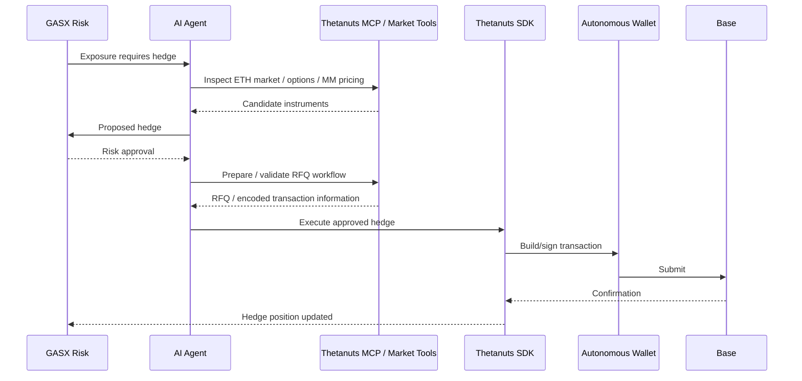

# GASX — Architecture

How the system is designed. For what GASX is, see [README.md](README.md). For what we are trying to achieve, see [GOALS.md](GOALS.md).

This file is the **navigational hub**: core architecture, principles, end-to-end flows and decision records. Detailed component designs live in [docs/](docs/).

## Docs Index

| Document | Covers |
|---|---|
| [docs/protocol.md](docs/protocol.md) | EGSI index, futures pricing, Sui Move contracts, order book, oracle, settlement, ETH settlement model |
| [docs/ai.md](docs/ai.md) | AI pricing engine (ensemble models), autonomous AI trader |
| [docs/thetanuts.md](docs/thetanuts.md) | Thetanuts strategy, autonomous safety policy, hedge adapter interface |
| [docs/backend.md](docs/backend.md) | C++ / Python / TypeScript backends, frontend, API contract, events, database |
| [docs/risk.md](docs/risk.md) | Risk architecture, Sui adapter, wallet strategy, security model |
| [docs/operations.md](docs/operations.md) | Cross-chain strategy, deployment, observability, testing, repository layout |

---

## 1. High-Level Architecture



---

## 2. Architectural Principle: Two Planes

GASX is split into a **Trading Plane** and an **Intelligence Plane**.

```text
                         GASX
                          |
              +-----------+-----------+
              |                       |
              v                       v
        TRADING PLANE           INTELLIGENCE PLANE
              |                       |
        Sui / Move              Python / AI
        Order Book              Forecasting
        Margin                  Sentiment
        Positions               Quant signals
        Settlement              Network analytics
        Oracle                  Agent logic
              |                       |
              +-----------+-----------+
                          |
                          v
                     C++ Risk
                     / Pricing
```

### Trading Plane

Authoritative, deterministic and on-chain.

### Intelligence Plane

Probabilistic, data-heavy and off-chain. It can recommend actions, but cannot bypass hard on-chain or risk-policy constraints.

---

## 3. Full Abstraction Boundary

The frontend must not know whether a service is implemented in C++, Python, TypeScript or Move.



Recommended domain interfaces:

```text
PricingProvider
MarketDataProvider
OrderProvider
ExecutionProvider
MarginProvider
SettlementProvider
OracleProvider
HedgeProvider
WalletProvider
```

This lets the UI remain unchanged if the internal implementation changes.

---

## 4. Sui Responsibilities

Sui is the native execution and settlement chain for GASX.

Sui provides the on-chain asset/object model and supports high-throughput, low-latency applications using Move. DeepBook V3 is an official/open-source Sui CLOB that can be reused for order-book infrastructure where its market model fits. [Sui Docs](https://docs.sui.io/) · [DeepBook V3](https://github.com/MystenLabs/deepbookv3)

### On-chain responsibilities

- Market configuration.
- Order lifecycle.
- Collateral locking.
- Position state.
- Trade events.
- Oracle state.
- Settlement windows.
- P&L calculation.
- Withdrawal rules.
- Emergency pause/circuit breakers.

### Important implementation decision

A conventional CLOB such as DeepBook V3 is designed primarily around spot-like base/quote trading. GASX futures require margin, bilateral exposure and maturity-based settlement. Therefore:

> **Do not force the complete futures semantics into an unmodified DeepBook pool.**

Instead, use DeepBook V3 as an open-source reference/component where practical and implement the futures-specific margin/position/settlement layer in a GASX Move package.

Possible implementation paths, in descending preference:

1. Reuse/adapt DeepBook V3 order-book components under its Apache-2.0 license.
2. Reuse its tested ordering/matching patterns and build a GASX-specific CLOB module.
3. Only if integration is substantially faster, represent a simplified futures instrument through a compatible DeepBook market abstraction plus GASX settlement wrappers.

The exact choice should be validated early with a tiny localnet prototype.

---

## 5. Open-Source Infrastructure Strategy

The team should **buy/reuse infrastructure and build only the differentiated layer**.

| Requirement | Prefer | Reason |
|---|---|---|
| Sui client | Mysten Sui TypeScript SDK | Native ecosystem support |
| Wallet connection | Sui dApp Kit / wallet-standard tooling | Avoid custom wallet plumbing |
| CLOB base | DeepBook V3 | Existing Sui on-chain CLOB, Apache-2.0 |
| HTTP API | FastAPI + TypeScript gateway | Fast iteration |
| RPC | viem / ethers where appropriate | Mature EVM tooling |
| Ethereum ingestion | ethers/viem + public RPC providers | Avoid custom node implementation |
| Data validation | Pydantic | Strong Python schemas |
| ML | PyTorch + scikit-learn + LightGBM/XGBoost | Mature open-source models |
| NLP | Hugging Face Transformers | Reusable open models |
| Feature storage | PostgreSQL | Simple, reliable MVP database |
| Cache | Redis | Fast live state/cache |
| Event bus | NATS | Lightweight event-driven architecture |
| Metrics | Prometheus + Grafana | Open-source observability |
| Containerization | Docker Compose | Fast local deployment |
| Charts | Lightweight Charts / equivalent OSS chart library | Fast trading UI |
| Thetanuts integration | Official Thetanuts SDK | Production application integration |
| Thetanuts discovery/dev | Thetanuts MCP | Live protocol inspection and agent tooling |
| Autonomous Thetanuts actions | Thetanuts AgentKit | Reuse official action provider/safety policy |
| Cross-chain messaging | Wormhole, only if required | Existing Sui/EVM connectivity |

The Thetanuts MCP repository explicitly describes the MCP as a read-only development-time layer and recommends the official Thetanuts client SDK for application runtime use. It also exposes tools for market data, MM pricing, order/position queries, RFQs and transaction encoding. [Thetanuts MCP](https://github.com/Shawnchee/thetanuts-mcp-server)

Thetanuts' current AgentKit example provides autonomous signing through a wallet provider and a configurable safety policy. [Thetanuts AgentKit example](https://github.com/Thetanuts-Finance/thetanuts-agentkit/blob/main/examples/mcp-server-quickstart.ts)

---

## 6. Complete Trade Flow



---

## 7. Complete AI Hedge Flow



---

## 8. Architecture Decisions Summary

| Decision | Final choice |
|---|---|
| Product | EGSI gas futures |
| Underlying | Ethereum blockspace stress |
| Native chain | Sui |
| Smart contracts | Move |
| Collateral | USDC |
| Settlement | ETH-denominated |
| Market | Peer-to-peer CLOB |
| CLOB infrastructure | DeepBook-derived/reused where compatible |
| Matching runtime | C++ replica/runtime |
| AI | Ensemble forecasting + regime + sentiment + quant |
| AI role | Pricing, forecasting, sizing, hedge decision |
| API layer | TypeScript |
| ML layer | Python |
| Frontend | React + TypeScript |
| Thetanuts role | Data + volatility + MM pricing + RFQ + hedge + positions + autonomous execution |
| Thetanuts MCP | Agent/development interface, not primary state-changing runtime |
| Thetanuts SDK | Runtime application integration |
| Thetanuts AgentKit | Autonomous hedge execution on supported EVM path |
| Oracle | Multi-publisher EGSI oracle |
| Database | PostgreSQL |
| Cache | Redis |
| Event bus | NATS |
| Deployment | Docker Compose for MVP |
| Cross-chain | Optional, isolated from core Sui trade path |

---

## 9. Source References

- Sui Documentation — https://docs.sui.io/
- DeepBook V3 — https://github.com/MystenLabs/deepbookv3
- Thetanuts SDK — https://github.com/Thetanuts-Finance/thetanuts-sdk
- Thetanuts MCP — https://github.com/Shawnchee/thetanuts-mcp-server
- Thetanuts AgentKit — https://github.com/Thetanuts-Finance/thetanuts-agentkit
- Sui USDC — https://www.circle.com/multi-chain-usdc/sui
- Wormhole — https://wormhole.com/docs/

---

## 10. Final Architecture Principle

**Build the smallest amount of infrastructure that is unique to GASX.**

Reuse:

```text
Sui tooling
wallet tooling
DeepBook components
PostgreSQL
Redis
NATS
FastAPI
PyTorch
LightGBM/XGBoost
Hugging Face
Thetanuts SDK
Thetanuts MCP
Thetanuts AgentKit
Wormhole (only when needed)
```

Build yourselves:

```text
EGSI
AI gas forecasting
futures semantics
margin/risk policy
Thetanuts hedge-selection logic
GASX frontend experience
```

The winning demo is not the one with the most components. It is the one where **a user can connect a wallet, see an AI-driven gas forecast, place a real gas-futures trade on Sui, and watch the system autonomously manage the resulting ETH risk through Thetanuts.**
