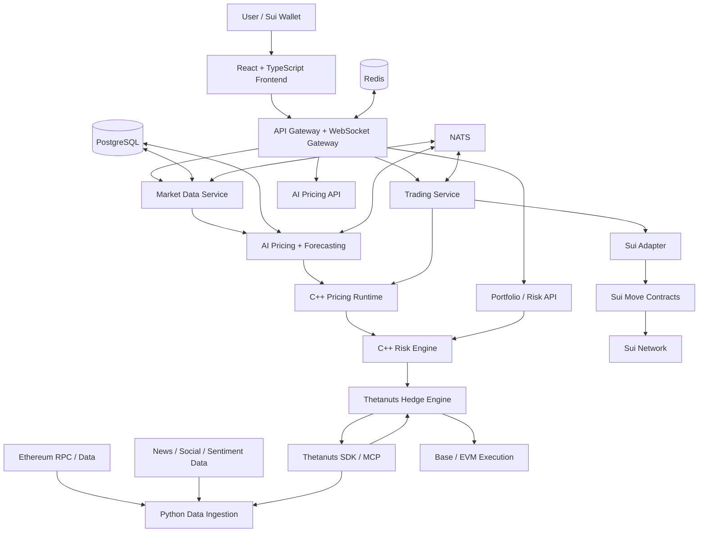
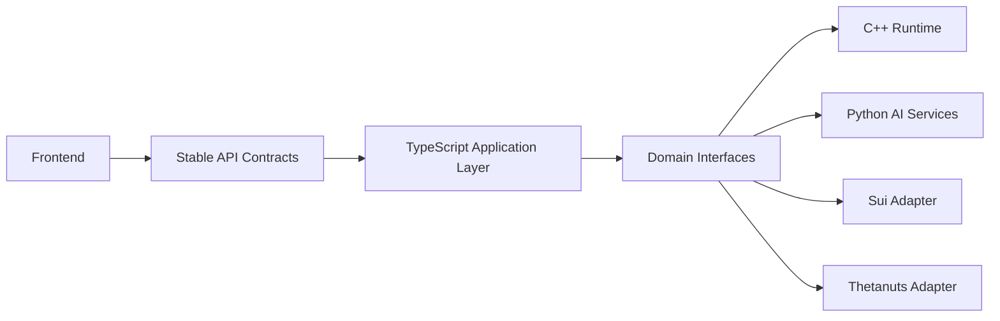
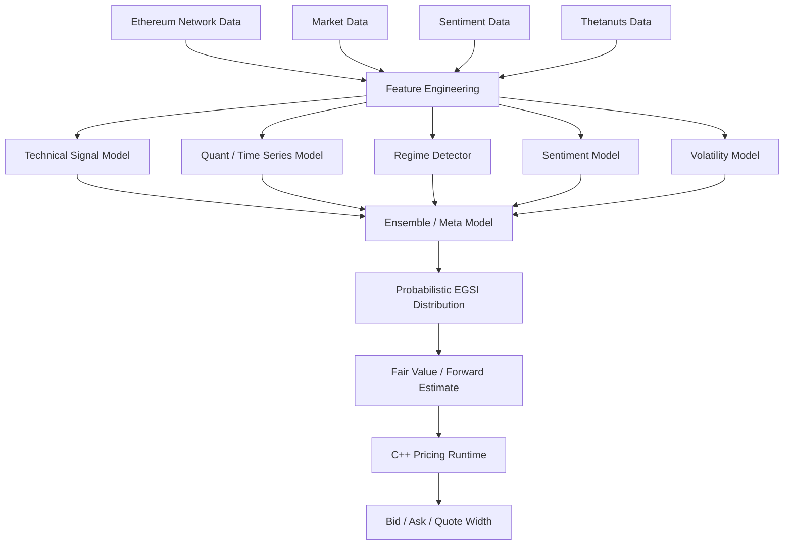
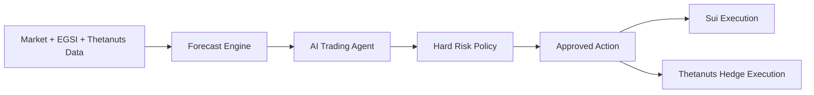
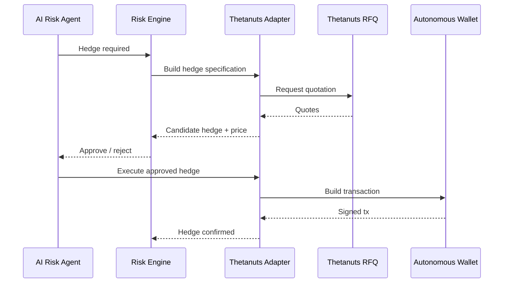
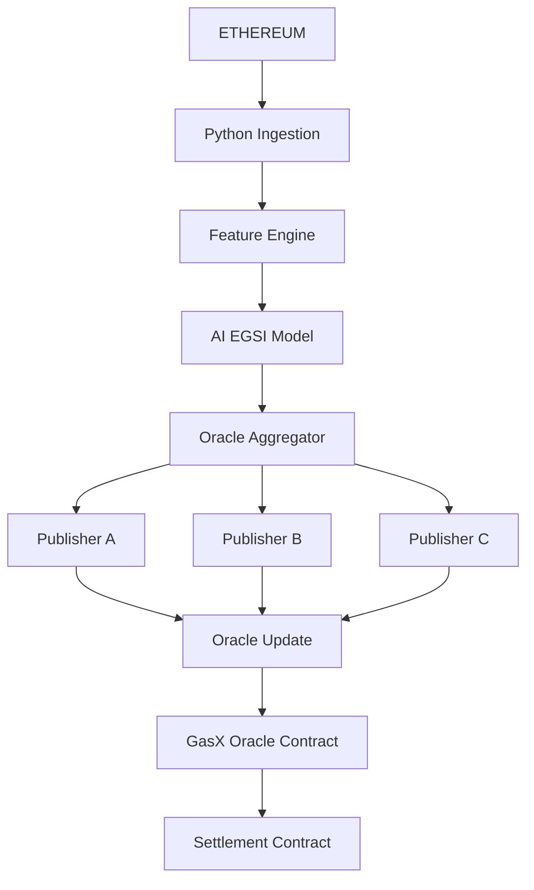
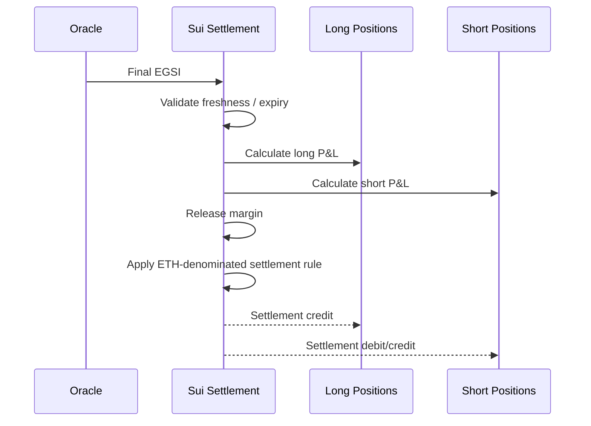
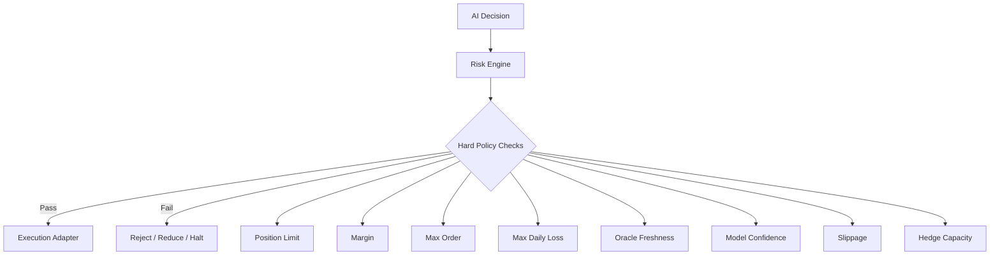
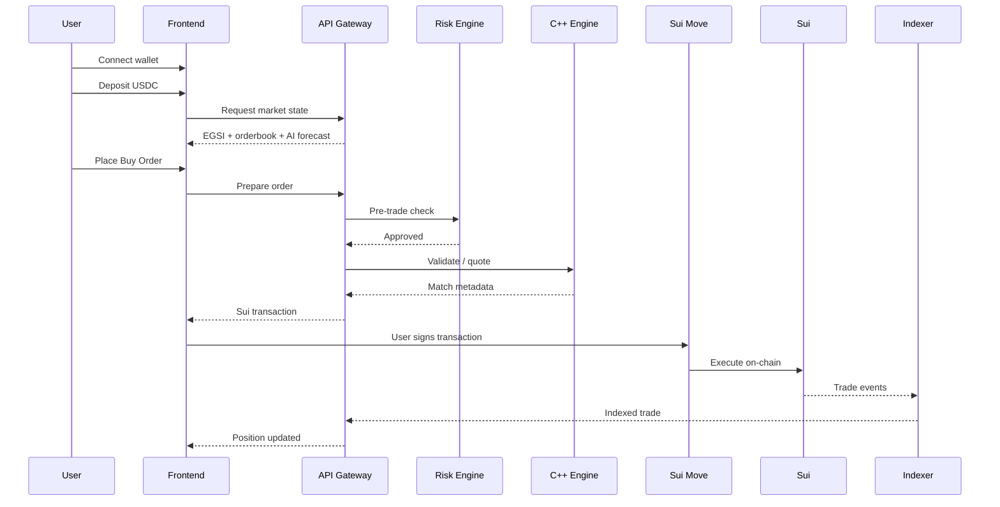
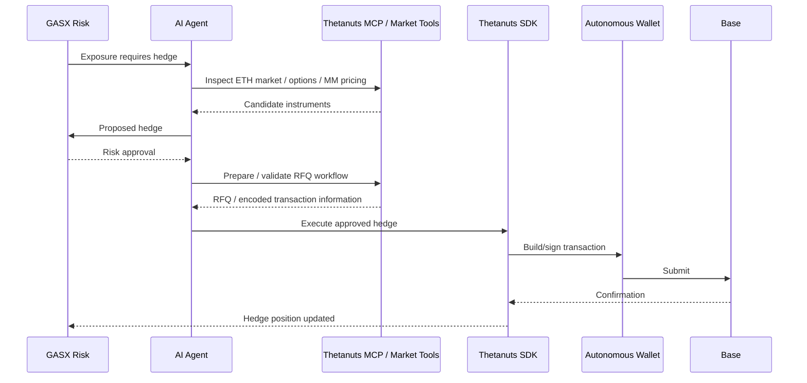

# GASX — Architecture

> **AI-native Ethereum Gas Futures Exchange on Sui, hedged with Thetanuts**
>
> Hackathon architecture: optimize for a credible end-to-end product and **at least one real on-chain trade**, while reusing audited/open-source infrastructure wherever practical.

---

## 1. Executive Summary

GASX turns Ethereum blockspace demand into a tradable derivative.

The platform creates an **Ethereum Gas Stress Index (EGSI)** from live Ethereum network conditions and uses AI to forecast its future value. Users trade short-dated EGSI futures against each other on **Sui**, posting **USDC collateral**. At expiry, the contract settles according to the final EGSI value, with P&L paid in an ETH-denominated settlement asset.

The system additionally uses **Thetanuts extensively as the external ETH-derivatives intelligence and hedging layer**:

- Thetanuts market data becomes an input to the AI/risk stack.
- Thetanuts MM pricing and order data provide market-implied ETH volatility/skew signals.
- Thetanuts RFQs are used to source executable hedge quotes.
- Thetanuts positions are incorporated into GASX portfolio/risk calculations.
- Thetanuts' AgentKit/action-provider path is used for autonomous hedge execution on Base, under hard safety limits.
- Thetanuts MCP is used as a development/agent interface for discovery, live inspection, quote/RFQ workflows and transaction encoding. The MCP itself is not the production runtime dependency for state-changing execution.

Sui is the source of truth for the GASX market: order placement, collateral locking, positions, trades, oracle snapshots and settlement are on-chain.

---

## 2. Problem

Ethereum gas demand can change very quickly. A user can observe cheap gas at one moment and severe congestion later, but there is no simple, purpose-built market in GASX form for trading that future network congestion.

GASX addresses three related problems:

1. **Congestion risk is hard to quantify**
   Gas price alone is an incomplete measure of future blockspace demand.

2. **There is limited direct price discovery for future Ethereum blockspace stress**
   Traders can speculate on ETH and ETH derivatives, but that is not the same as directly trading expected gas congestion.

3. **DeFi derivatives platforms need better cross-venue risk management**
   Gas exposure can create correlated ETH risk. Thetanuts gives GASX an existing derivatives venue from which to obtain market information and hedge that risk instead of building another options protocol.

---

## 3. Solution

### 3.1 Product

GASX offers short-dated futures on the **Ethereum Gas Stress Index (EGSI)**.

Example market:

```text
EGSI-1H

Underlying: Ethereum Gas Stress Index
Expiry:     1 hour
Collateral: USDC
Settlement: ETH-denominated P&L

Example:
Current EGSI = 420
Trader buys 5 contracts at 425
Final EGSI = 500

Long P&L = (500 - 425) × contract_multiplier × 5
```

The first hackathon version should launch **one market** well instead of many maturities.

Recommended initial market:

```text
EGSI-1H
```

Later:

```text
EGSI-15M
EGSI-1H
EGSI-4H
EGSI-24H
```

### 3.2 Why an index instead of raw Gwei?

Raw gas price is noisy and can be distorted by short-lived fee spikes. EGSI combines:

- base fee
- priority fee
- gas used
- block utilization
- transaction throughput
- mempool pressure
- gas momentum
- fee volatility
- DeFi activity
- DEX activity
- liquidation activity
- ETH volatility
- stablecoin activity
- market/social sentiment
- Thetanuts ETH options market signals

The index therefore describes **network stress and future blockspace demand**, not simply today's gas price.

---

# 4. Design Goals

## 4.1 Hackathon goals

The demo must be able to:

1. Connect a Sui-compatible wallet.
2. Display live Ethereum gas conditions.
3. Produce a live EGSI value.
4. Produce an AI forecast and confidence score.
5. Display an on-chain order book.
6. Submit a real order.
7. Match/execute a real trade on Sui.
8. Show the resulting position.
9. Calculate portfolio exposure.
10. Query Thetanuts for an ETH hedge opportunity.
11. Execute or demonstrate a real Thetanuts hedge path under strict limits.

## 4.2 Engineering goals

- Fully on-chain GASX trading and settlement.
- Frontend completely abstracted from implementation details.
- C++ for latency-sensitive trading/risk/pricing runtime.
- Python for data science, model training and inference services.
- TypeScript for APIs, Sui client integration, wallet integration and Thetanuts integration.
- Move for Sui smart contracts.
- Open-source modules wherever they reduce implementation risk.
- Hard risk controls independent of AI decisions.

## 4.3 Explicit non-goals for the hackathon

- Building a new blockchain.
- Building a generic oracle network from scratch.
- Building a full cross-chain settlement protocol.
- Supporting dozens of contract maturities.
- Building a production-grade custody system.
- Building an HFT-grade distributed matching cluster.
- Reimplementing Thetanuts' options protocol.

---

# 5. High-Level Architecture



---

# 6. Architectural Principle: Two Planes

GASX is split into a **Trading Plane** and an **Intelligence Plane**.

```text
                         GASX
                          |
              +-----------+-----------+
              |                       |
              v                       v
        TRADING PLANE           INTELLIGENCE PLANE
              |                       |
        Sui / Move              Python / AI
        Order Book              Forecasting
        Margin                  Sentiment
        Positions               Quant signals
        Settlement              Network analytics
        Oracle                  Agent logic
              |                       |
              +-----------+-----------+
                          |
                          v
                     C++ Risk
                     / Pricing
```

### Trading Plane

Authoritative, deterministic and on-chain.

### Intelligence Plane

Probabilistic, data-heavy and off-chain. It can recommend actions, but cannot bypass hard on-chain or risk-policy constraints.

---

# 7. Full Abstraction Boundary

The frontend must not know whether a service is implemented in C++, Python, TypeScript or Move.



Recommended domain interfaces:

```text
PricingProvider
MarketDataProvider
OrderProvider
ExecutionProvider
MarginProvider
SettlementProvider
OracleProvider
HedgeProvider
WalletProvider
```

This lets the UI remain unchanged if the internal implementation changes.

---

# 8. Sui Responsibilities

Sui is the native execution and settlement chain for GASX.

Sui provides the on-chain asset/object model and supports high-throughput, low-latency applications using Move. DeepBook V3 is an official/open-source Sui CLOB that can be reused for order-book infrastructure where its market model fits. [Sui Docs](https://docs.sui.io/) · [DeepBook V3](https://github.com/MystenLabs/deepbookv3)

### On-chain responsibilities

- Market configuration.
- Order lifecycle.
- Collateral locking.
- Position state.
- Trade events.
- Oracle state.
- Settlement windows.
- P&L calculation.
- Withdrawal rules.
- Emergency pause/circuit breakers.

### Important implementation decision

A conventional CLOB such as DeepBook V3 is designed primarily around spot-like base/quote trading. GASX futures require margin, bilateral exposure and maturity-based settlement. Therefore:

> **Do not force the complete futures semantics into an unmodified DeepBook pool.**

Instead, use DeepBook V3 as an open-source reference/component where practical and implement the futures-specific margin/position/settlement layer in a GASX Move package.

Possible implementation paths, in descending preference:

1. Reuse/adapt DeepBook V3 order-book components under its Apache-2.0 license.
2. Reuse its tested ordering/matching patterns and build a GASX-specific CLOB module.
3. Only if integration is substantially faster, represent a simplified futures instrument through a compatible DeepBook market abstraction plus GASX settlement wrappers.

The exact choice should be validated early with a tiny localnet prototype.

---

# 9. Open-Source Infrastructure Strategy

The team should **buy/reuse infrastructure and build only the differentiated layer**.

| Requirement | Prefer | Reason |
|---|---|---|
| Sui client | Mysten Sui TypeScript SDK | Native ecosystem support |
| Wallet connection | Sui dApp Kit / wallet-standard tooling | Avoid custom wallet plumbing |
| CLOB base | DeepBook V3 | Existing Sui on-chain CLOB, Apache-2.0 |
| HTTP API | FastAPI + TypeScript gateway | Fast iteration |
| RPC | viem / ethers where appropriate | Mature EVM tooling |
| Ethereum ingestion | ethers/viem + public RPC providers | Avoid custom node implementation |
| Data validation | Pydantic | Strong Python schemas |
| ML | PyTorch + scikit-learn + LightGBM/XGBoost | Mature open-source models |
| NLP | Hugging Face Transformers | Reusable open models |
| Feature storage | PostgreSQL | Simple, reliable MVP database |
| Cache | Redis | Fast live state/cache |
| Event bus | NATS | Lightweight event-driven architecture |
| Metrics | Prometheus + Grafana | Open-source observability |
| Containerization | Docker Compose | Fast local deployment |
| Charts | Lightweight Charts / equivalent OSS chart library | Fast trading UI |
| Thetanuts integration | Official Thetanuts SDK | Production application integration |
| Thetanuts discovery/dev | Thetanuts MCP | Live protocol inspection and agent tooling |
| Autonomous Thetanuts actions | Thetanuts AgentKit | Reuse official action provider/safety policy |
| Cross-chain messaging | Wormhole, only if required | Existing Sui/EVM connectivity |

The Thetanuts MCP repository explicitly describes the MCP as a read-only development-time layer and recommends the official Thetanuts client SDK for application runtime use. It also exposes tools for market data, MM pricing, order/position queries, RFQs and transaction encoding. [Thetanuts MCP](https://github.com/Shawnchee/thetanuts-mcp-server)

Thetanuts' current AgentKit example provides autonomous signing through a wallet provider and a configurable safety policy. [Thetanuts AgentKit example](https://github.com/Thetanuts-Finance/thetanuts-agentkit/blob/main/examples/mcp-server-quickstart.ts)

---

# 10. EGSI — Ethereum Gas Stress Index

## 10.1 Objective

EGSI should estimate **current and near-future Ethereum blockspace stress** on a normalized scale.

```text
EGSI = 0 to 1000
```

Interpretation:

```text
0–100      Very low stress
100–250    Low / normal
250–400    Elevated
400–600    High congestion
600–800    Severe congestion
800–1000   Extreme congestion
```

These bands are product conventions, not external market standards.

## 10.2 Base signal families

### Network state

- Base fee.
- Priority fee.
- Gas used per block.
- Gas limit.
- Block utilization.
- Transactions per block.
- Pending transaction estimates where available.
- Fee distribution.
- Failed transaction rate.

### Demand/activity

- DEX volume.
- DeFi activity.
- Stablecoin transfers.
- Lending activity.
- Liquidations.
- Bridge activity.
- Contract creation.
- Large transfer bursts.

### Market regime

- ETH return.
- ETH realized volatility.
- ETH volume.
- Crypto market risk-on/risk-off state.

### Sentiment

- Ethereum sentiment.
- DeFi sentiment.
- memecoin sentiment.
- volatility/panic sentiment.
- news intensity.
- social acceleration.

### Derivatives market signals via Thetanuts

- ETH option implied volatility.
- Volatility term structure.
- Call/put skew where available.
- Thetanuts MM bid/ask pricing.
- RFQ quote dispersion.
- ETH derivative liquidity.
- Thetanuts market activity/position information where permitted by the integration.

The purpose of Thetanuts data here is not to pretend options equal gas. It provides an external **ETH risk and volatility state** that helps explain and hedge gas-driven crypto risk.

---

# 11. AI Pricing Engine

The pricing engine is an ensemble rather than one black-box model.



## 11.1 Model A — Technical gas analysis

Features:

- EMA 5/20/50.
- RSI.
- MACD.
- Momentum.
- Rate of change.
- Rolling volatility.
- Base-fee acceleration.
- Gas-used momentum.
- Utilization momentum.

Apply these to **gas/network variables**, not just ETH price.

## 11.2 Model B — Quantitative forecasting

Use a small set of robust models rather than one huge model:

- LightGBM/XGBoost for tabular nonlinear features.
- Gradient-boosted quantile regression for forecast intervals.
- ARIMA/state-space baseline for sanity checking.
- Optional GRU/LSTM/Temporal Transformer if the dataset is large enough.

The ensemble should be compared against naive baselines such as:

```text
last_value
moving_average
exponential_moving_average
seasonal_baseline
```

A more complex model only enters production if it beats these baselines out-of-sample.

## 11.3 Model C — Regime detection

Classes:

```text
QUIET
NORMAL
GROWTH
CONGESTION
SHOCK
```

Use volatility, utilization, fee acceleration, volume and activity statistics.

The regime changes model weighting.

## 11.4 Model D — Sentiment

Pipeline:

```text
News / Social Text
        ↓
Deduplication
        ↓
Spam / bot filtering
        ↓
Crypto sentiment model
        ↓
Topic classifier
        ↓
Time-decayed sentiment score
        ↓
Blockspace demand signal
```

Topic labels:

```text
Ethereum
DeFi
DEX
NFT
Memecoin
MEV
Liquidation
Airdrop
Market panic
```

Sentiment does **not** directly determine EGSI. It is a leading indicator for potential blockspace demand.

## 11.5 Model E — Probabilistic forecast

Return a distribution rather than a single value.

Example:

```text
P(EGSI < 350)       0.10
P(350–400)          0.18
P(400–450)          0.30
P(450–500)          0.24
P(EGSI > 500)      0.18

Expected EGSI      444
Forecast confidence 87%
```

This distribution is then consumed by the pricing/risk engine.

---

# 12. Futures Pricing

AI forecasting produces the expected settlement distribution. The actual market quote then incorporates:

```text
Expected EGSI
+ forecast variance
+ time to expiry
+ liquidity
+ order-book imbalance
+ inventory/risk
+ model uncertainty
+ hedge cost
+ safety spread
```

Output:

```text
Fair Value
Bid
Ask
Expected Volatility
Confidence
Tail Probability
Recommended Position Size
```

Example:

```text
EGSI-1H

AI Fair Value       441.2
Bid                 437.8
Ask                 444.9
Expected Vol        69.4
Confidence           91%
P(EGSI > 500)       21%
```

The C++ runtime should calculate the final quote deterministically from a model output schema and hard-coded risk constraints.

---

# 13. Autonomous AI Trader

The AI agent is an orchestrator, not the fundamental mathematical pricing model.



### Agent tools

```text
get_egsi()
get_gas_metrics()
get_orderbook()
get_market_history()
get_ai_forecast()
get_portfolio()
get_margin()
get_risk()
get_thetanuts_markets()
get_thetanuts_mm_price()
get_thetanuts_positions()
request_thetanuts_rfq()
get_thetanuts_hedge_candidates()
place_gasx_order()
cancel_gasx_order()
execute_thetanuts_hedge()
```

### AI decision examples

```text
FORECAST:
EGSI expected +8.4%

CONFIDENCE:
88%

CURRENT EXPOSURE:
Moderate long

DECISION:
Add 2 contracts

HEDGE:
ETH beta increased beyond threshold
Request Thetanuts ETH option RFQ
```

---

# 14. Thetanuts Strategy — Expanded Usage

Thetanuts should be used in **multiple parts of the system**, not only once for hedging.

## 14.1 Thetanuts as an external derivatives data source

Use Thetanuts data to enhance the AI feature set:

```text
ETH price
ETH options prices
IV
skew
term structure
MM bid/ask
RFQ dispersion
liquidity
```

This helps distinguish:

```text
"gas is rising because Ethereum is busy"
```

from:

```text
"gas is rising inside a broad crypto volatility shock"
```

Those situations should produce different hedge behavior.

## 14.2 Thetanuts as an implied-volatility reference

Use Thetanuts ETH option markets to estimate a market-implied volatility state.

This becomes an input to:

```text
EGSI forecast uncertainty
hedge sizing
risk limits
spread widening
shock detection
```

## 14.3 Thetanuts MM pricing

Thetanuts MM pricing can be used as a second independent market estimate.

GASX can compare:

```text
Our estimated ETH risk
vs
Thetanuts market-implied risk
```

This becomes a useful sanity check for the autonomous agent.

## 14.4 Thetanuts RFQs

When GASX needs a hedge:



## 14.5 Thetanuts positions in portfolio risk

The risk engine tracks both:

```text
GASX positions on Sui
+
Thetanuts hedge positions on Base
```

Then computes a combined risk state.

Example:

```text
GASX gas exposure       +1.8 ETH-equivalent beta
Thetanuts hedge         -1.1 ETH-equivalent
Residual exposure       +0.7 ETH-equivalent
```

## 14.6 Thetanuts autonomous execution

Use the Thetanuts AgentKit/action provider for the autonomous path where supported. Its current example uses a Base wallet provider plus explicit safety limits such as maximum notional, exact approval policy and allowed collateral. Keep those limits below any secret/configuration-controlled maximum that the model cannot modify. [Thetanuts AgentKit](https://github.com/Thetanuts-Finance/thetanuts-agentkit)

## 14.7 Thetanuts MCP

Use the MCP as an agent/development interface for:

- live market inspection
- pricing discovery
- order/position inspection
- RFQ construction
- transaction encoding
- validating SDK behavior against current protocol state

Do **not** make the read-only MCP server the application's state-changing production dependency. Use the official Thetanuts client SDK for runtime integration. [Thetanuts MCP](https://github.com/Shawnchee/thetanuts-mcp-server)

## 14.8 Optional: Thetanuts lending / treasury intelligence

If available and useful in the hackathon environment, Thetanuts lending/opportunity data can be used for idle treasury analytics. This is an optional extension and should not block the trading demo.

---

# 15. GASX Sui Smart Contracts

Recommended package structure:

```text
contracts/
└── gasx/
    ├── Move.toml
    └── sources/
        ├── market.move
        ├── orderbook.move
        ├── order.move
        ├── margin.move
        ├── position.move
        ├── oracle.move
        ├── settlement.move
        ├── risk.move
        ├── events.move
        └── admin.move
```

## 15.1 Core on-chain objects

```text
Market
Order
Position
MarginAccount
OracleState
SettlementWindow
```

## 15.2 Market object

```text
Market
├── market_id
├── underlying = EGSI
├── expiry
├── contract_multiplier
├── tick_size
├── min_order_size
├── status
├── oracle_id
└── risk_parameters
```

## 15.3 Position

```text
Position
├── trader
├── market
├── side
├── quantity
├── entry_price
├── locked_margin
├── realized_pnl
└── status
```

## 15.4 Margin

USDC is the collateral asset.

```text
Available USDC
      |
      | order / position
      v
Locked Margin
      |
      | close / cancel
      v
Available USDC
```

The on-chain contract must calculate required margin deterministically.

---

# 16. Order Book Design

### Source of truth

The final order/trade state lives on Sui.

### Off-chain acceleration

C++ can maintain a local replica for:

- fast market display
- quote calculations
- simulation
- risk calculations
- pre-trade validation

But the C++ replica is **not authoritative**.

```text
C++ local book
      |
      | proposal / execution transaction
      v
Sui Move book
      |
      v
Canonical state
```

## 16.1 C++ order engine

Components:

```text
OrderBook
MatchingEngine
PriceTimePriority
QuoteEngine
InventoryTracker
PreTradeRisk
MarketDataPublisher
```

Use integer/fixed-point arithmetic for prices and quantities. Avoid floating-point values in financial state transitions.

---

# 17. Oracle Design

EGSI is not a native Sui datum, so it requires an oracle pipeline.



## 17.1 Hackathon oracle

Use multiple independent publisher processes.

Example:

```text
Publisher A
Publisher B
Publisher C

2 of 3 signatures/attestations required
```

Each publisher should independently compute EGSI from the agreed feature specification.

The oracle should include:

```text
index_value
observation_timestamp
source_block
model_version
feature_version
publisher_id
nonce
```

## 17.2 Oracle safety

Settlement should reject:

- stale updates
- wrong market
- wrong expiry
- unexpected model version
- invalid publisher threshold
- impossible index values

---

# 18. Settlement

At expiry:



The initial contract should use a simple linear payoff so that the Move logic is easy to audit.

---

# 19. ETH Settlement Model

The product specification requires:

```text
Collateral = USDC
Settlement = ETH-denominated P&L
```

Because Sui does not natively settle in Ethereum's native ETH asset, the implementation must use an explicit **Sui-compatible ETH representation** or a bridge/wrapped asset path.

This is isolated behind:

```text
SettlementAssetProvider
```

so the futures engine does not depend on a particular bridge implementation.

For the hackathon:

1. Keep the core GASX contract denominated in an abstract settlement-asset type.
2. Use a Sui-compatible ETH representation available in the target environment.
3. If the exact ETH asset/bridge path is not stable enough for the deadline, demonstrate the full trade/settlement state machine on Sui and gate the final external asset transfer behind a clearly isolated adapter.

USDC should use Sui-compatible native USDC wherever supported by the target deployment. [Circle USDC on Sui](https://www.circle.com/multi-chain-usdc/sui)

---

# 20. C++ Backend

C++ is responsible for the performance-sensitive core.

```text
engine/
├── orderbook/
├── matching/
├── pricing/
├── risk/
├── portfolio/
├── marketdata/
└── protocol/
```

## 20.1 C++ services

### Pricing Runtime

Consumes a normalized model response:

```json
{
  "market": "EGSI-1H",
  "expected_value": 441.2,
  "volatility": 69.4,
  "confidence": 0.91,
  "tail_probability": 0.21,
  "model_version": "egsi-v1.3"
}
```

Produces:

```text
fair_price
bid
ask
quote_size
```

### Risk Engine

Responsibilities:

- position limits
- margin requirements
- leverage checks
- concentration
- max loss
- model-confidence limits
- oracle freshness checks
- hedge ratio
- circuit breakers

---

# 21. Python AI Backend

Recommended stack:

```text
Python 3.x
FastAPI
Pydantic
Pandas / Polars
NumPy
scikit-learn
LightGBM / XGBoost
PyTorch
Hugging Face Transformers
MLflow (optional)
```

Repository:

```text
ai/
├── ingestion/
├── normalization/
├── features/
├── technical/
├── quant/
├── sentiment/
├── regime/
├── models/
├── inference/
├── backtesting/
└── evaluation/
```

The Python service exposes a versioned inference API to the C++ pricing runtime.

---

# 22. TypeScript Backend

TypeScript owns integration-heavy responsibilities.

```text
api/
├── routes/
├── websocket/
├── auth/
├── services/
└── schemas/

blockchain/
├── sui/
├── thetanuts/
└── wormhole/
```

## Responsibilities

- REST gateway.
- WebSocket gateway.
- Sui SDK.
- Wallet transaction creation.
- Thetanuts SDK.
- Thetanuts MCP integration for agent/developer workflows.
- Thetanuts AgentKit integration where autonomous Base execution is enabled.
- Event indexing.
- API schema validation.

---

# 23. Frontend

```text
frontend/
├── components/
├── pages/
├── hooks/
├── services/
├── state/
├── wallet/
└── types/
```

Recommended stack:

```text
React
TypeScript
Vite
Tailwind CSS
TanStack Query
Sui dApp Kit
Lightweight Charts
```

### Main screens

#### Dashboard

```text
EGSI
438.6

AI Fair Value
441.2

Congestion Probability
72%

Block Utilization
91%

Mempool Pressure
78%

AI Confidence
91%
```

#### Trading Terminal

```text
Chart | Order Book | Trade Form | Positions
```

#### AI Intelligence

```text
Network signals
Technical signals
Quant forecast
Sentiment
Thetanuts risk state
AI decision history
```

#### Portfolio

```text
USDC margin
Open positions
Unrealized P&L
Realized P&L
ETH hedge
Residual exposure
```

---

# 24. API Contract

The frontend only communicates through stable domain APIs.

## REST

```text
GET  /api/v1/markets
GET  /api/v1/markets/:market/orderbook
GET  /api/v1/markets/:market/history
GET  /api/v1/markets/:market/forecast
GET  /api/v1/markets/:market/signals

GET  /api/v1/account/:address
GET  /api/v1/positions/:address
GET  /api/v1/orders/:address

POST /api/v1/orders/prepare
POST /api/v1/orders/cancel/prepare

GET  /api/v1/risk/:address
GET  /api/v1/thetanuts/hedges
POST /api/v1/thetanuts/hedges/quote
POST /api/v1/thetanuts/hedges/prepare
```

`prepare` endpoints return transaction payloads; the user's wallet or an explicitly authorized autonomous wallet signs them.

## WebSocket

```text
/ws/markets/:market
/ws/orderbook/:market
/ws/trades/:market
/ws/account/:address
/ws/ai/:market
/ws/risk/:address
```

---

# 25. Event-Driven System

Use NATS for low-friction event transport.

Topics:

```text
market.egsi.updated
market.orderbook.updated
market.trade.executed
market.order.created
market.order.cancelled

risk.position.updated
risk.margin.updated
risk.limit.breached

ai.forecast.updated
ai.decision.created

hedge.requested
thetanuts.quote.received
hedge.executed

settlement.started
settlement.completed
```

PostgreSQL remains the durable application database; NATS is the transport, not the source of truth.

---

# 26. Database

PostgreSQL tables:

```text
users
wallets
markets
orders
trades
positions
margin_accounts
oracle_updates
settlements

eth_blocks
gas_samples
network_activity
sentiment_samples
features

model_versions
model_predictions
ai_decisions

risk_events
hedge_requests
thetanuts_quotes
thetanuts_positions
```

Redis:

```text
live EGSI
orderbook snapshots
hot market data
session / websocket state
rate limits
```

---

# 27. Risk Architecture

The most important principle:

> **AI can request an action. It cannot bypass policy.**



Recommended hackathon limits:

```text
MAX_ORDER_CONTRACTS = small fixed cap
MAX_POSITION_CONTRACTS = small fixed cap
MAX_SLIPPAGE = 1%
MIN_MODEL_CONFIDENCE = 70%
MAX_DAILY_LOSS = configured small limit
MAX_HEDGE_NOTIONAL = configured small limit
```

The exact values are deployment configuration, not hard-coded economic assumptions.

---

# 28. Autonomous Thetanuts Safety Policy

The autonomous Thetanuts wallet must be isolated from user funds.

It should only hold a small, explicit hedge budget.

Example policy:

```text
allowedCollateral = [USDC]
maxNotionalPerAction = small fixed amount
maxApprovalAmount = exact
allowedNetworks = [Base]
allowedAssets = [ETH, USDC]
```

The policy must be enforced outside the language model.

The current Thetanuts AgentKit example demonstrates this safety-policy pattern for autonomous Base execution. [Reference](https://github.com/Thetanuts-Finance/thetanuts-agentkit/blob/main/examples/mcp-server-quickstart.ts)

---

# 29. Thetanuts Adapter Interface

Do not spread Thetanuts-specific types throughout GASX.

```cpp
// Conceptual interface; actual implementation lives in TypeScript.
class HedgeProvider {
public:
    virtual HedgeQuote getBestHedge(const RiskState&) = 0;
    virtual HedgeExecution prepareExecution(const HedgeQuote&) = 0;
    virtual HedgePosition getPosition() = 0;
};
```

TypeScript adapter:

```text
ThetanutsHedgeProvider
        |
        +--> Thetanuts Client SDK
        +--> Thetanuts MCP tools (agent/dev workflows)
        +--> AgentKit action provider
```

This prevents the rest of GASX from depending on Thetanuts-specific implementation details.

---

# 30. Sui Adapter Interface

```text
SuiExecutionProvider

prepareDeposit()
preparePlaceOrder()
prepareCancelOrder()
prepareClosePosition()
prepareSettlement()
getMarketState()
getPosition()
```

The frontend receives serialized transaction payloads rather than raw contract implementation details.

---

# 31. Wallet Strategy

### User wallets

Sui-compatible wallets through Sui dApp Kit / wallet-standard tooling.

### Optional EVM wallet

Only required for the Thetanuts hedge path if the hedge is executed by the user's own EVM wallet.

### Autonomous hedge wallet

Separate server-side wallet controlled by Thetanuts AgentKit/CDP infrastructure or another appropriately scoped signing layer.

Never reuse the application's deployment/admin key as the trading wallet.

---

# 32. Cross-Chain Strategy

The GASX core should **not** require cross-chain messaging for every trade.

```text
Sui
 |
 +-- GASX trades
 +-- USDC margin
 +-- futures positions
 +-- GASX settlement

Base
 |
 +-- Thetanuts hedge
```

Cross-chain components such as Wormhole should only be introduced for:

- moving hedge collateral
- moving supported assets
- synchronizing limited hedge-state messages
- future automated treasury rebalancing

Wormhole's current support matrix includes Sui and Base for several messaging/token-transfer products, so it is a viable candidate when cross-chain functionality becomes necessary. [Wormhole support matrix](https://wormhole.com/docs/products/connect/reference/support-matrix/)

For the first successful trade, keep the Sui trading path independent of the bridge.

---

# 33. Complete Trade Flow



---

# 34. Complete AI Hedge Flow



---

# 35. Deployment

Hackathon deployment:

```text
                    Cloud / VPS
                         |
       +-----------------+------------------+
       |                 |                  |
       v                 v                  v
  Frontend           Backend             AI
  Vite/Static        Docker              Docker
       |                 |                  |
       |          +------+-------+          |
       |          |      |       |          |
       |          v      v       v          |
       |       API    C++ Core  Indexer     |
       |                 |                  |
       +-----------------+------------------+
                         |
                 PostgreSQL + Redis
                         |
                       NATS
```

Use Docker Compose initially.

Do not introduce Kubernetes unless the hackathon infrastructure specifically requires it.

---

# 36. Observability

Use open-source monitoring.

### Metrics

```text
Prometheus
Grafana
```

Track:

```text
egsi_current
ai_forecast_error
model_confidence
order_latency
trade_count
trade_volume
oracle_age
risk_rejections
thetanuts_quote_latency
hedge_success_rate
sui_transaction_success_rate
```

### Logs

Structured JSON logs with:

```text
request_id
wallet_address_hash
market_id
order_id
trade_id
model_version
oracle_version
transaction_digest
```

Never log private keys or wallet secrets.

---

# 37. Testing Strategy

## Move

- Unit tests.
- Position/margin invariants.
- Settlement edge cases.
- Oracle freshness tests.
- Overflow/underflow tests.
- Authorization tests.

## C++

- Matching engine tests.
- Price-time priority tests.
- Risk limit tests.
- Fixed-point arithmetic tests.

## Python

- Feature tests.
- Leakage checks.
- Backtests.
- Model regression tests.
- Forecast calibration.

## TypeScript

- API schema tests.
- Sui transaction construction tests.
- Thetanuts adapter tests.
- Wallet flow tests.

## Integration

One golden-path test:

```text
wallet
 -> deposit
 -> place order
 -> match
 -> position
 -> settlement
 -> hedge request
```

---

# 38. Security Model

## User funds

User funds live in on-chain contracts, not in the API service.

## Admin authority

Use narrowly scoped admin capabilities.

Admin should be able to:

- pause market
- update risk parameters
- rotate oracle publisher
- upgrade contracts where intentionally supported

Admin should not silently modify existing user balances or positions.

## AI isolation

The AI service cannot directly call arbitrary blockchain transactions.

Every state-changing action goes through:

```text
AI
 -> policy
 -> risk engine
 -> adapter
 -> explicit transaction
```

## Secrets

Use environment/secret manager storage for:

```text
RPC URLs
API keys
Thetanuts credentials
EVM autonomous wallet secrets
oracle publisher keys
```

Never commit secrets.

The Thetanuts SDK guidance also recommends pinning versions and inspecting transactions before signing. [Thetanuts SDK security guidance](https://github.com/Thetanuts-Finance/thetanuts-sdk/security)

---

# 39. Recommended Repository Structure

```text
gasx/
├── ARCHITECTURE.md
├── README.md
├── docker-compose.yml
├── .env.example
│
├── frontend/
│   ├── src/
│   └── package.json
│
├── api/
│   ├── src/
│   └── package.json
│
├── engine/
│   ├── include/
│   ├── src/
│   └── tests/
│
├── ai/
│   ├── ingestion/
│   ├── features/
│   ├── models/
│   ├── inference/
│   └── tests/
│
├── blockchain/
│   ├── sui/
│   ├── thetanuts/
│   └── wormhole/
│
├── contracts/
│   └── gasx/
│
├── oracle/
│   ├── publishers/
│   └── aggregator/
│
├── indexer/
│
├── database/
│   └── migrations/
│
├── infra/
│   ├── docker/
│   └── monitoring/
│
└── docs/
    ├── protocol.md
    ├── ai.md
    ├── security.md
    └── demo.md
```

---

# 40. Recommended Build Order

The project should be built in this order to maximize the probability of a real trade.

## Phase 0 — Integration spike

Before building anything elaborate:

1. Publish a tiny Move package on Sui testnet.
2. Connect a Sui wallet.
3. Execute a basic USDC transaction.
4. Clone/build DeepBook V3 locally and verify the SDK/contract workflow.
5. Run Thetanuts MCP and inspect live tool responses.
6. Install the official Thetanuts client SDK.
7. Verify Thetanuts market data and a read-only ETH pricing flow.
8. Verify the Thetanuts AgentKit example in a **strictly limited test environment**.

Do these first because integration surprises are more dangerous than model work.

## Phase 1 — Sui market

Build:

```text
Market
Order
Margin
Position
Trade event
Settlement
```

Get one deterministic manual trade working.

## Phase 2 — Frontend trading terminal

Build:

```text
wallet
market screen
orderbook
buy/sell form
positions
transaction status
```

## Phase 3 — EGSI

Implement the simplest index:

```text
base fee
+ utilization
+ fee momentum
+ volatility
```

Then add more features.

## Phase 4 — AI

Implement:

```text
baseline
-> LightGBM/XGBoost
-> quantile forecast
-> regime classifier
-> sentiment
-> Thetanuts volatility signals
```

## Phase 5 — Thetanuts

Implement:

```text
market data
MM pricing
option-chain analytics
RFQ
hedge selection
position monitoring
```

## Phase 6 — Autonomous hedge

Enable Thetanuts AgentKit execution behind a tiny hard-coded risk budget.

## Phase 7 — Demo polish

Add:

```text
AI terminal
agent activity feed
risk visualization
Thetanuts hedge view
on-chain transaction explorer links
```

---

# 41. Minimum Viable Demo

The absolute minimum successful demo is:

```text
1. Connect Sui wallet
2. Show live Ethereum network data
3. Show EGSI
4. Show AI forecast
5. Deposit USDC
6. Place BUY/SELL order
7. Execute a real Sui transaction
8. Show trade in on-chain state
9. Show position
10. Show Thetanuts-derived hedge analysis
11. Request an actual Thetanuts quote
12. Execute a tightly limited hedge if environment permits
```

The system should still be a valid GASX demo if the optional cross-chain transfer is unavailable.

---

# 42. Hackathon Demo Script

### Step 1 — Market opens

```text
EGSI = 418
```

### Step 2 — AI detects congestion

```text
Block utilization       ↑
Base fee acceleration   ↑
Mempool pressure        ↑
DeFi activity           ↑
Sentiment               ↑

AI forecast:
EGSI → 487
P(EGSI > 500) = 72%
```

### Step 3 — Trader acts

User buys 5 EGSI futures.

### Step 4 — Sui settles the trade

The transaction digest is shown in the UI.

### Step 5 — Risk changes

GASX computes increased ETH-related risk.

### Step 6 — Thetanuts is invoked

The system queries Thetanuts market/MM pricing and requests a hedge quote.

### Step 7 — Autonomous hedge

The AI agent proposes a hedge. Hard risk rules approve it. Thetanuts AgentKit executes within a tiny configured limit.

### Step 8 — Explainability

Show:

```text
Why GASX bought
Why the hedge was selected
What risk was reduced
What the current EGSI forecast is
```

This produces a complete story rather than a collection of disconnected features.

---

# 43. What Is Actually Novel?

The novelty should not be marketed as "AI trading" alone.

The stronger product thesis is:

> **GASX creates a new financial primitive around Ethereum blockspace demand.**

AI turns heterogeneous network and market signals into a forecastable index. Sui provides the native on-chain market and settlement layer. Thetanuts provides an external ETH derivatives market that supplies market-implied information and hedging capability.

This creates a closed loop:

```text
Ethereum activity
      ↓
AI network forecast
      ↓
EGSI
      ↓
Gas futures market on Sui
      ↓
Portfolio risk
      ↓
Thetanuts ETH hedge
      ↓
New market information
      ↓
AI updates forecast
```

---

# 44. Production Evolution After the Hackathon

If GASX moves beyond the hackathon:

### Phase A

- multiple maturities
- deeper liquidity
- stronger oracle security
- better model calibration
- formal Move verification where justified

### Phase B

- permissionless market creation
- institutional API
- market-maker SDK
- advanced cross-margin
- richer Thetanuts hedge strategies

### Phase C

- multi-chain user access
- automated treasury management
- additional blockspace indices
- Base / Arbitrum / Solana congestion indices
- standardized blockchain congestion derivatives

Potential future products:

```text
ETH-GAS-1H
ETH-GAS-4H
ETH-GAS-24H
L2-GAS-1H
BASE-GAS-1H
ARB-GAS-1H
BLOB-GAS-1H
```

---

# 45. Architecture Decisions Summary

| Decision | Final choice |
|---|---|
| Product | EGSI gas futures |
| Underlying | Ethereum blockspace stress |
| Native chain | Sui |
| Smart contracts | Move |
| Collateral | USDC |
| Settlement | ETH-denominated |
| Market | Peer-to-peer CLOB |
| CLOB infrastructure | DeepBook-derived/reused where compatible |
| Matching runtime | C++ replica/runtime |
| AI | Ensemble forecasting + regime + sentiment + quant |
| AI role | Pricing, forecasting, sizing, hedge decision |
| API layer | TypeScript |
| ML layer | Python |
| Frontend | React + TypeScript |
| Thetanuts role | Data + volatility + MM pricing + RFQ + hedge + positions + autonomous execution |
| Thetanuts MCP | Agent/development interface, not primary state-changing runtime |
| Thetanuts SDK | Runtime application integration |
| Thetanuts AgentKit | Autonomous hedge execution on supported EVM path |
| Oracle | Multi-publisher EGSI oracle |
| Database | PostgreSQL |
| Cache | Redis |
| Event bus | NATS |
| Deployment | Docker Compose for MVP |
| Cross-chain | Optional, isolated from core Sui trade path |

---

# 46. Source References

- Sui Documentation — https://docs.sui.io/
- DeepBook V3 — https://github.com/MystenLabs/deepbookv3
- Thetanuts SDK — https://github.com/Thetanuts-Finance/thetanuts-sdk
- Thetanuts MCP — https://github.com/Shawnchee/thetanuts-mcp-server
- Thetanuts AgentKit — https://github.com/Thetanuts-Finance/thetanuts-agentkit
- Sui USDC — https://www.circle.com/multi-chain-usdc/sui
- Wormhole — https://wormhole.com/docs/

---

# 47. Final Architecture Principle

**Build the smallest amount of infrastructure that is unique to GASX.**

Reuse:

```text
Sui tooling
wallet tooling
DeepBook components
PostgreSQL
Redis
NATS
FastAPI
PyTorch
LightGBM/XGBoost
Hugging Face
Thetanuts SDK
Thetanuts MCP
Thetanuts AgentKit
Wormhole (only when needed)
```

Build yourselves:

```text
EGSI
AI gas forecasting
futures semantics
margin/risk policy
Thetanuts hedge-selection logic
GASX frontend experience
```

The winning demo is not the one with the most components. It is the one where **a user can connect a wallet, see an AI-driven gas forecast, place a real gas-futures trade on Sui, and watch the system autonomously manage the resulting ETH risk through Thetanuts.**
