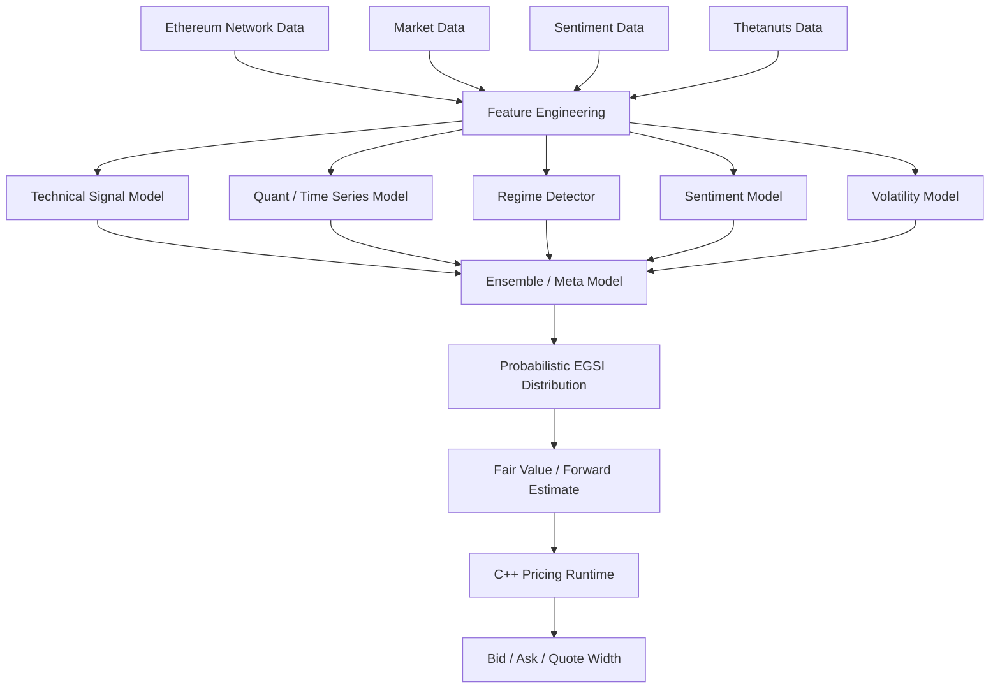
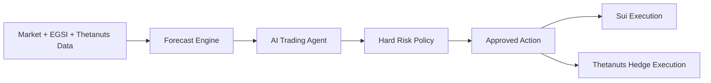

# GASX — AI Design

The AI pricing engine and the autonomous trading agent. Back to [ARCHITECTURE.md](../ARCHITECTURE.md).

---

## 1. AI Pricing Engine

The pricing engine is an ensemble rather than one black-box model.



### 1.1 Model A — Technical gas analysis

Features:

- EMA 5/20/50.
- RSI.
- MACD.
- Momentum.
- Rate of change.
- Rolling volatility.
- Base-fee acceleration.
- Gas-used momentum.
- Utilization momentum.

Apply these to **gas/network variables**, not just ETH price.

### 1.2 Model B — Quantitative forecasting

Use a small set of robust models rather than one huge model:

- LightGBM/XGBoost for tabular nonlinear features.
- Gradient-boosted quantile regression for forecast intervals.
- ARIMA/state-space baseline for sanity checking.
- Optional GRU/LSTM/Temporal Transformer if the dataset is large enough.

The ensemble should be compared against naive baselines such as:

```text
last_value
moving_average
exponential_moving_average
seasonal_baseline
```

A more complex model only enters production if it beats these baselines out-of-sample.

### 1.3 Model C — Regime detection

Classes:

```text
QUIET
NORMAL
GROWTH
CONGESTION
SHOCK
```

Use volatility, utilization, fee acceleration, volume and activity statistics.

The regime changes model weighting.

### 1.4 Model D — Sentiment

Pipeline:

```text
News / Social Text
        ↓
Deduplication
        ↓
Spam / bot filtering
        ↓
Crypto sentiment model
        ↓
Topic classifier
        ↓
Time-decayed sentiment score
        ↓
Blockspace demand signal
```

Topic labels:

```text
Ethereum
DeFi
DEX
NFT
Memecoin
MEV
Liquidation
Airdrop
Market panic
```

Sentiment does **not** directly determine EGSI. It is a leading indicator for potential blockspace demand.

### 1.5 Model E — Probabilistic forecast

Return a distribution rather than a single value.

Example:

```text
P(EGSI < 350)       0.10
P(350–400)          0.18
P(400–450)          0.30
P(450–500)          0.24
P(EGSI > 500)      0.18

Expected EGSI      444
Forecast confidence 87%
```

This distribution is then consumed by the pricing/risk engine.

---

## 2. Autonomous AI Trader

The AI agent is an orchestrator, not the fundamental mathematical pricing model.



### Agent tools

```text
get_egsi()
get_gas_metrics()
get_orderbook()
get_market_history()
get_ai_forecast()
get_portfolio()
get_margin()
get_risk()
get_thetanuts_markets()
get_thetanuts_mm_price()
get_thetanuts_positions()
request_thetanuts_rfq()
get_thetanuts_hedge_candidates()
place_gasx_order()
cancel_gasx_order()
execute_thetanuts_hedge()
```

### AI decision examples

```text
FORECAST:
EGSI expected +8.4%

CONFIDENCE:
88%

CURRENT EXPOSURE:
Moderate long

DECISION:
Add 2 contracts

HEDGE:
ETH beta increased beyond threshold
Request Thetanuts ETH option RFQ
```
