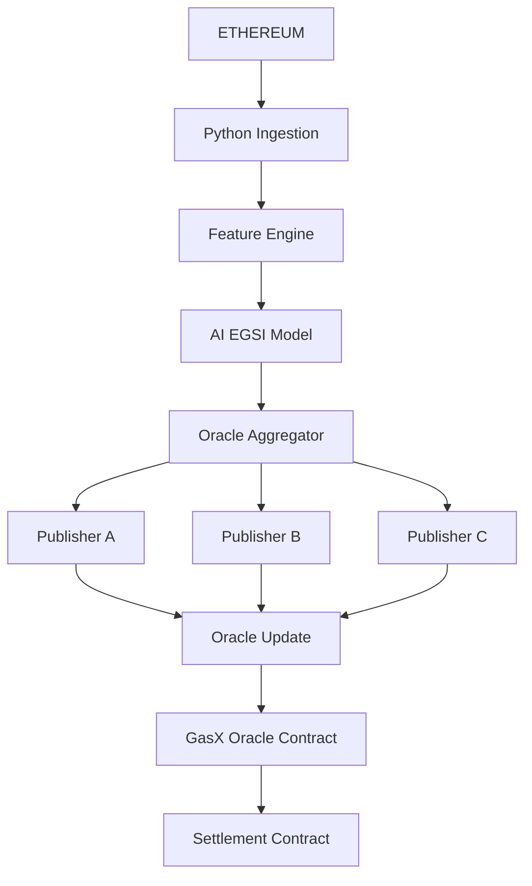
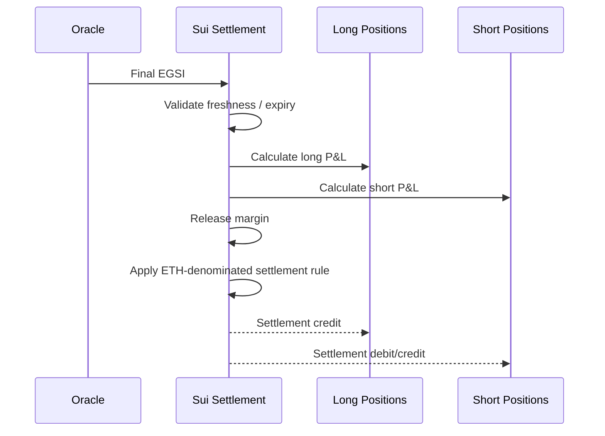

# GASX — Protocol Design

The financial core: EGSI index, pricing, on-chain contracts, order book, oracle and settlement. Back to [ARCHITECTURE.md](../ARCHITECTURE.md).

---

## 1. EGSI — Ethereum Gas Stress Index

### 1.1 Objective

EGSI should estimate **current and near-future Ethereum blockspace stress** on a normalized scale.

```text
EGSI = 0 to 1000
```

Interpretation:

```text
0–100      Very low stress
100–250    Low / normal
250–400    Elevated
400–600    High congestion
600–800    Severe congestion
800–1000   Extreme congestion
```

These bands are product conventions, not external market standards.

### 1.2 Base signal families

#### Network state

- Base fee.
- Priority fee.
- Gas used per block.
- Gas limit.
- Block utilization.
- Transactions per block.
- Pending transaction estimates where available.
- Fee distribution.
- Failed transaction rate.

#### Demand/activity

- DEX volume.
- DeFi activity.
- Stablecoin transfers.
- Lending activity.
- Liquidations.
- Bridge activity.
- Contract creation.
- Large transfer bursts.

#### Market regime

- ETH return.
- ETH realized volatility.
- ETH volume.
- Crypto market risk-on/risk-off state.

#### Sentiment

- Ethereum sentiment.
- DeFi sentiment.
- memecoin sentiment.
- volatility/panic sentiment.
- news intensity.
- social acceleration.

#### Derivatives market signals via Thetanuts

- ETH option implied volatility.
- Volatility term structure.
- Call/put skew where available.
- Thetanuts MM bid/ask pricing.
- RFQ quote dispersion.
- ETH derivative liquidity.
- Thetanuts market activity/position information where permitted by the integration.

The purpose of Thetanuts data here is not to pretend options equal gas. It provides an external **ETH risk and volatility state** that helps explain and hedge gas-driven crypto risk.

---

## 2. Futures Pricing

AI forecasting produces the expected settlement distribution. The actual market quote then incorporates:

```text
Expected EGSI
+ forecast variance
+ time to expiry
+ liquidity
+ order-book imbalance
+ inventory/risk
+ model uncertainty
+ hedge cost
+ safety spread
```

Output:

```text
Fair Value
Bid
Ask
Expected Volatility
Confidence
Tail Probability
Recommended Position Size
```

Example:

```text
EGSI-1H

AI Fair Value       441.2
Bid                 437.8
Ask                 444.9
Expected Vol        69.4
Confidence           91%
P(EGSI > 500)       21%
```

The C++ runtime should calculate the final quote deterministically from a model output schema and hard-coded risk constraints.

---

## 3. GASX Sui Smart Contracts

Recommended package structure:

```text
contracts/
└── gasx/
    ├── Move.toml
    └── sources/
        ├── market.move
        ├── orderbook.move
        ├── order.move
        ├── margin.move
        ├── position.move
        ├── oracle.move
        ├── settlement.move
        ├── risk.move
        ├── events.move
        └── admin.move
```

### 3.1 Core on-chain objects

```text
Market
Order
Position
MarginAccount
OracleState
SettlementWindow
```

### 3.2 Market object

```text
Market
├── market_id
├── underlying = EGSI
├── expiry
├── contract_multiplier
├── tick_size
├── min_order_size
├── status
├── oracle_id
└── risk_parameters
```

### 3.3 Position

```text
Position
├── trader
├── market
├── side
├── quantity
├── entry_price
├── locked_margin
├── realized_pnl
└── status
```

### 3.4 Margin

USDC is the collateral asset.

```text
Available USDC
      |
      | order / position
      v
Locked Margin
      |
      | close / cancel
      v
Available USDC
```

The on-chain contract must calculate required margin deterministically.

---

## 4. Order Book Design

### Source of truth

The final order/trade state lives on Sui.

### Off-chain acceleration

C++ can maintain a local replica for:

- fast market display
- quote calculations
- simulation
- risk calculations
- pre-trade validation

But the C++ replica is **not authoritative**.

```text
C++ local book
      |
      | proposal / execution transaction
      v
Sui Move book
      |
      v
Canonical state
```

### 4.1 C++ order engine

Components:

```text
OrderBook
MatchingEngine
PriceTimePriority
QuoteEngine
InventoryTracker
PreTradeRisk
MarketDataPublisher
```

Use integer/fixed-point arithmetic for prices and quantities. Avoid floating-point values in financial state transitions.

---

## 5. Oracle Design

EGSI is not a native Sui datum, so it requires an oracle pipeline.



### 5.1 Hackathon oracle

Use multiple independent publisher processes.

Example:

```text
Publisher A
Publisher B
Publisher C

2 of 3 signatures/attestations required
```

Each publisher should independently compute EGSI from the agreed feature specification.

The oracle should include:

```text
index_value
observation_timestamp
source_block
model_version
feature_version
publisher_id
nonce
```

### 5.2 Oracle safety

Settlement should reject:

- stale updates
- wrong market
- wrong expiry
- unexpected model version
- invalid publisher threshold
- impossible index values

---

## 6. Settlement

At expiry:



The initial contract should use a simple linear payoff so that the Move logic is easy to audit.

---

## 7. ETH Settlement Model

The product specification requires:

```text
Collateral = USDC
Settlement = ETH-denominated P&L
```

Because Sui does not natively settle in Ethereum's native ETH asset, the implementation must use an explicit **Sui-compatible ETH representation** or a bridge/wrapped asset path.

This is isolated behind:

```text
SettlementAssetProvider
```

so the futures engine does not depend on a particular bridge implementation.

For the hackathon:

1. Keep the core GASX contract denominated in an abstract settlement-asset type.
2. Use a Sui-compatible ETH representation available in the target environment.
3. If the exact ETH asset/bridge path is not stable enough for the deadline, demonstrate the full trade/settlement state machine on Sui and gate the final external asset transfer behind a clearly isolated adapter.

USDC should use Sui-compatible native USDC wherever supported by the target deployment. [Circle USDC on Sui](https://www.circle.com/multi-chain-usdc/sui)
