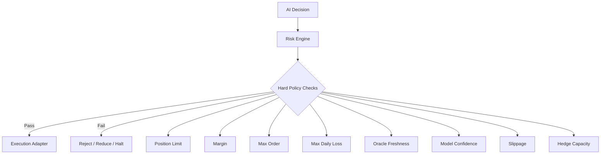

# GASX — Risk & Security

Risk architecture, adapters, wallet strategy and the security model. Back to [ARCHITECTURE.md](../ARCHITECTURE.md).

---

## 1. Risk Architecture

The most important principle:

> **AI can request an action. It cannot bypass policy.**



Recommended hackathon limits:

```text
MAX_ORDER_CONTRACTS = small fixed cap
MAX_POSITION_CONTRACTS = small fixed cap
MAX_SLIPPAGE = 1%
MIN_MODEL_CONFIDENCE = 70%
MAX_DAILY_LOSS = configured small limit
MAX_HEDGE_NOTIONAL = configured small limit
```

The exact values are deployment configuration, not hard-coded economic assumptions.

---

## 2. Sui Adapter Interface

```text
SuiExecutionProvider

prepareDeposit()
preparePlaceOrder()
prepareCancelOrder()
prepareClosePosition()
prepareSettlement()
getMarketState()
getPosition()
```

The frontend receives serialized transaction payloads rather than raw contract implementation details.

---

## 3. Wallet Strategy

### User wallets

Sui-compatible wallets through Sui dApp Kit / wallet-standard tooling.

### Optional EVM wallet

Only required for the Thetanuts hedge path if the hedge is executed by the user's own EVM wallet.

### Autonomous hedge wallet

Separate server-side wallet controlled by Thetanuts AgentKit/CDP infrastructure or another appropriately scoped signing layer.

Never reuse the application's deployment/admin key as the trading wallet.

---

## 4. Security Model

### User funds

User funds live in on-chain contracts, not in the API service.

### Admin authority

Use narrowly scoped admin capabilities.

Admin should be able to:

- pause market
- update risk parameters
- rotate oracle publisher
- upgrade contracts where intentionally supported

Admin should not silently modify existing user balances or positions.

### AI isolation

The AI service cannot directly call arbitrary blockchain transactions.

Every state-changing action goes through:

```text
AI
 -> policy
 -> risk engine
 -> adapter
 -> explicit transaction
```

### Secrets

Use environment/secret manager storage for:

```text
RPC URLs
API keys
Thetanuts credentials
EVM autonomous wallet secrets
oracle publisher keys
```

Never commit secrets.

The Thetanuts SDK guidance also recommends pinning versions and inspecting transactions before signing. [Thetanuts SDK security guidance](https://github.com/Thetanuts-Finance/thetanuts-sdk/security)
