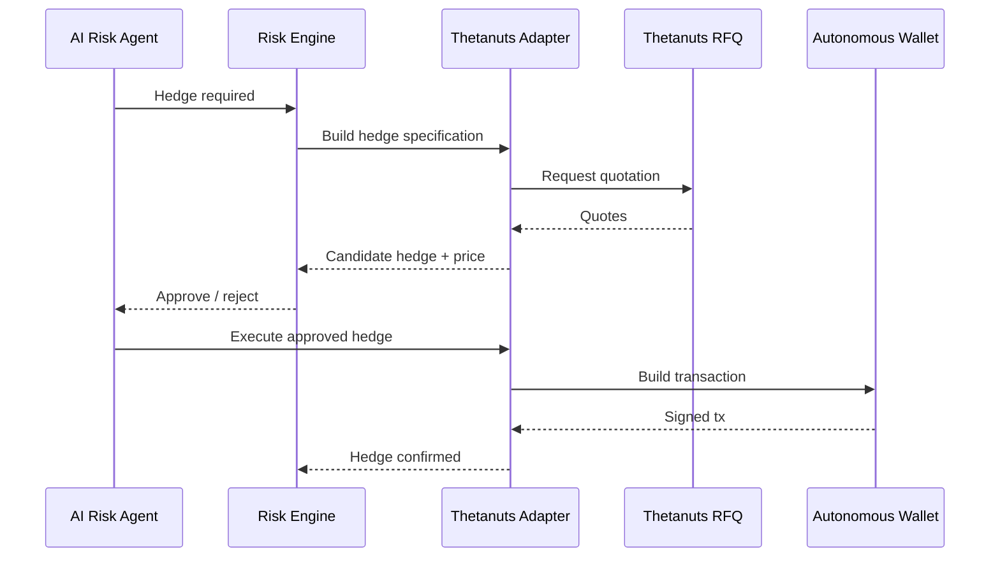

# GASX — Thetanuts Integration

Thetanuts strategy, autonomous safety policy and adapter interface. Back to [ARCHITECTURE.md](../ARCHITECTURE.md).

---

## 1. Thetanuts Strategy — Expanded Usage

Thetanuts should be used in **multiple parts of the system**, not only once for hedging.

### 1.1 Thetanuts as an external derivatives data source

Use Thetanuts data to enhance the AI feature set:

```text
ETH price
ETH options prices
IV
skew
term structure
MM bid/ask
RFQ dispersion
liquidity
```

This helps distinguish:

```text
"gas is rising because Ethereum is busy"
```

from:

```text
"gas is rising inside a broad crypto volatility shock"
```

Those situations should produce different hedge behavior.

### 1.2 Thetanuts as an implied-volatility reference

Use Thetanuts ETH option markets to estimate a market-implied volatility state.

This becomes an input to:

```text
EGSI forecast uncertainty
hedge sizing
risk limits
spread widening
shock detection
```

### 1.3 Thetanuts MM pricing

Thetanuts MM pricing can be used as a second independent market estimate.

GASX can compare:

```text
Our estimated ETH risk
vs
Thetanuts market-implied risk
```

This becomes a useful sanity check for the autonomous agent.

### 1.4 Thetanuts RFQs

When GASX needs a hedge:



### 1.5 Thetanuts positions in portfolio risk

The risk engine tracks both:

```text
GASX positions on Sui
+
Thetanuts hedge positions on Base
```

Then computes a combined risk state.

Example:

```text
GASX gas exposure       +1.8 ETH-equivalent beta
Thetanuts hedge         -1.1 ETH-equivalent
Residual exposure       +0.7 ETH-equivalent
```

### 1.6 Thetanuts autonomous execution

Use the Thetanuts AgentKit/action provider for the autonomous path where supported. Its current example uses a Base wallet provider plus explicit safety limits such as maximum notional, exact approval policy and allowed collateral. Keep those limits below any secret/configuration-controlled maximum that the model cannot modify. [Thetanuts AgentKit](https://github.com/Thetanuts-Finance/thetanuts-agentkit)

### 1.7 Thetanuts MCP

Use the MCP as an agent/development interface for:

- live market inspection
- pricing discovery
- order/position inspection
- RFQ construction
- transaction encoding
- validating SDK behavior against current protocol state

Do **not** make the read-only MCP server the application's state-changing production dependency. Use the official Thetanuts client SDK for runtime integration. [Thetanuts MCP](https://github.com/Shawnchee/thetanuts-mcp-server)

### 1.8 Optional: Thetanuts lending / treasury intelligence

If available and useful in the hackathon environment, Thetanuts lending/opportunity data can be used for idle treasury analytics. This is an optional extension and should not block the trading demo.

---

## 2. Autonomous Thetanuts Safety Policy

The autonomous Thetanuts wallet must be isolated from user funds.

It should only hold a small, explicit hedge budget.

Example policy:

```text
allowedCollateral = [USDC]
maxNotionalPerAction = small fixed amount
maxApprovalAmount = exact
allowedNetworks = [Base]
allowedAssets = [ETH, USDC]
```

The policy must be enforced outside the language model.

The current Thetanuts AgentKit example demonstrates this safety-policy pattern for autonomous Base execution. [Reference](https://github.com/Thetanuts-Finance/thetanuts-agentkit/blob/main/examples/mcp-server-quickstart.ts)

---

## 3. Thetanuts Adapter Interface

Do not spread Thetanuts-specific types throughout GASX.

```cpp
// Conceptual interface; actual implementation lives in TypeScript.
class HedgeProvider {
public:
    virtual HedgeQuote getBestHedge(const RiskState&) = 0;
    virtual HedgeExecution prepareExecution(const HedgeQuote&) = 0;
    virtual HedgePosition getPosition() = 0;
};
```

TypeScript adapter:

```text
ThetanutsHedgeProvider
        |
        +--> Thetanuts Client SDK
        +--> Thetanuts MCP tools (agent/dev workflows)
        +--> AgentKit action provider
```

This prevents the rest of GASX from depending on Thetanuts-specific implementation details.
